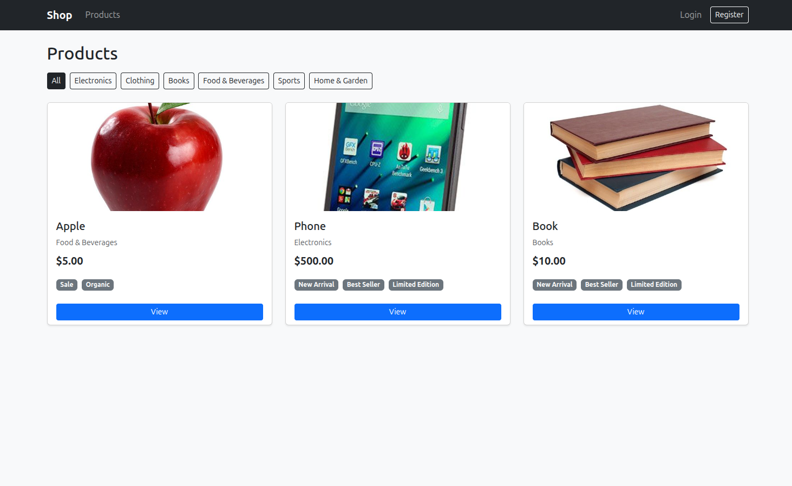

# Shop

A shopping app where admins manage products and users browse and place orders.



**Live site**: https://dscc-shop-00019248.duckdns.org

## Features

- Secure access via end-to-end authentication
- Create products with categories and tags
- Create orders and monitor their status online

## Technologies

- Python 
- Uv
- Gunicorn
- Postgres 
- Nginx
- Docker
- Docker Compose

## Local Setup

**Requirements:** Python, Postgres, Uv

```bash
git clone git@github.com:dxtym/shop
cd shop

uv sync

cp .env.example .env 

uv run python manage.py migrate
uv run python manage.py runserver
```

## Testing

```bash
pytest
pytest -v
```

## Deployment

**Requirements:** Docker, Docker Compose

```bash
cp .env.example .env
docker compose up --build -d
```

## Environment Variables

- DB_NAME
- DB_USER
- DB_PASSWORD
- DB_HOST
- DB_PORT
- ADMIN_USERNAME
- ADMIN_EMAIL
- ADMIN_PASSWORD
- SECRET_KEY
- DEBUG
- ALLOWED_HOSTS

## CI/CD Pipeline

GitHub Actions workflow on push to `main`:

1. **Lint and Test** — Run flake8 and pytest
2. **Build and Push** — Push image to Docker Hub
3. **Deploy** — SSH into server, pull image, run migrations